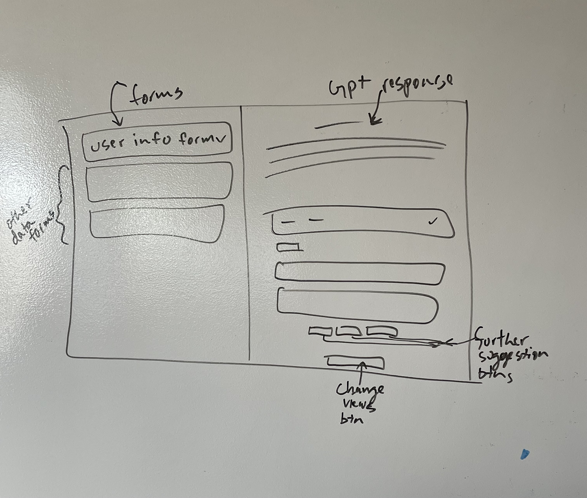

# AI-Powered Health Records Interpreter

## Description

This project is an AI-powered interface designed to interpret health records, recognize patterns, and provide user-friendly insights. The aim is to bridge the gap between raw data and everyday wellness.

## Tech Stack

- React
- Material-UI (MUI)
- Jest for testing
- OpenAI APIs

## Features

- **AI Interpretation**: Leverages AI to interpret complex health data and provide understandable insights.
- **Data Visualization**: Graphically presents data to provide an intuitive understanding of health metrics.
- **User Friendly**: Designed with a focus on user experience, making health data analysis approachable for everyone.

## Video Demo

[Watch the video demo here](https://www.youtube.com/watch?v=EbpVhN9ZqhY)

## Installation & Usage

git clone https://github.com/your-github-username/your-repo-name.git
cd your-repo-name
npm install
npm start

This runs the app in development mode. Open [http://localhost:3000](http://localhost:3000) to view it in the browser.

## Testing

npm test

Launches the test runner in the interactive watch mode.

## Wireframes

## Contributing

We'd love to accept your patches and contributions to this project. Whether it's fixing bugs, improving documentation, adding new features, or providing translations, please fork the repository and submit your pull requests!

## Feedback

We'd love to hear your thoughts, feedback, and ideas on how we can make this better! Feel free to open an issue, submit a pull request, or just drop us a message.

## Roadmap

coming soon..

## Project Status

mvp done, not hosted only able to run locally, use json files for mock data that is attached in this project

## Credits

Roman Protoliuk

## Contact Information

For more information, please reach out to me on [LinkedIn](https://www.linkedin.com/in/roman-protoliuk-a5340a170).
